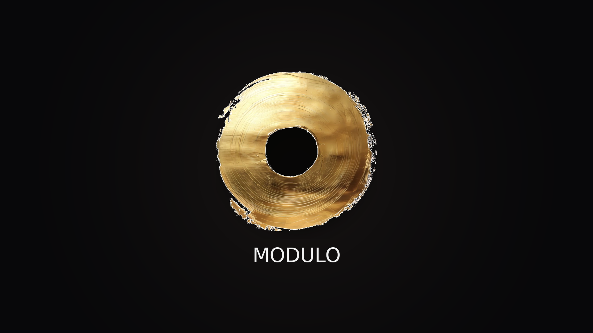

# MODULO AI DAW

MODULO (Musician-Owned DAW User-Led Orchestration) is a standalone DAW built on Tracktion Engine + JUCE, with an AI-native harmony workflow focused on chord generation and exploration.

This repository contains the code needed to build and run MODULO, including the custom DAW app and integrated ReaLchords-based generation flow.



## Why the Name "Modulo"

`Modulo` is not only an acronym. In computation, the modulo (`%`) operator returns the remainder after division. The remainder metaphor is central to this project:

- Most Music AI systems optimize toward a single "best" continuation.
- MODULO instead exposes the "remainder" of plausible harmonic futures.
- By generating multiple chord alternatives for the same melody, it helps the musician navigate the residual solution space that one-shot generation usually hides.

In short, MODULO is designed to return what deterministic generation leaves on the table.

## What MODULO Does

- Timeline-based DAW editing with audio + MIDI tracks.
- Real-time MIDI monitoring, recording, clip editing, and plugin hosting.
- Piano roll editing with lasso multi-select, smooth drag/resize, velocity coloring, and zoom.
- Chord option generation for melodies using a ReaLchords batch server.
- Chord inspection panel with playback-follow highlighting.
- Enhanced transport UI with bars/beats + time + tempo + key + time signature.
- Branded `Modulo.app` bundle with custom dock icon.

## Novelty and Thesis Focus

The core novelty is the harmony-assistance workflow and its framing in Music AI:

- Melody-conditioned chord generation using a ReaLchords model path.
- Fast generation of multiple chord alternatives for one melody phrase.
- Immediate in-DAW placement of generated chord options on dedicated tracks.
- Human-in-the-loop compositional exploration of harmonic possibilities.

This focuses on expanding the creative "space of possibilities" for harmony rather than producing a single deterministic accompaniment.

### Why this matters for Music AI

- **From answer-machine to co-creator:** The model proposes options; the artist steers.
- **Supports real compositional thinking:** Harmony writing is branching and comparative, not linear.
- **Improves controllability:** Users can audition alternatives in context rather than regenerate blindly.
- **Bridges research and production:** The same workflow runs inside a working DAW, not only a notebook/demo.
- **Encourages stylistic diversity:** Multi-option outputs reduce convergence toward a single generic result.

## AI Technical Deep Dive

MODULO's harmony system is built around an online accompaniment framing rather than offline "generate full song" paradigms.

- **Online conditioning:** Melody is represented as time-stepped note events, then streamed to a local generation service so chord decisions remain aligned with timeline context.
- **Multi-hypothesis decoding:** Instead of one deterministic chord sequence, MODULO requests multiple candidate accompaniments in one pass and materializes each as a dedicated MIDI track for A/B comparison.
- **Temporal alignment pipeline:** The app converts MIDI into frame-domain events for model IO, then reconstructs beat-aligned MIDI clips in Tracktion's edit timeline so generated harmony is immediately playable/editable.
- **Interactive control surface:** Playback style controls (block/arpeggio), grid-locked arpeggio timing, and bar-level sustain automation turn model outputs into production-ready musical gestures.
- **Human-in-the-loop ranking:** The final "selection" step is musical judgment in context (arrangement, timbre, rhythm), not only model confidence.

This combination is the core contribution: model-guided harmonic exploration embedded directly inside a DAW interaction loop.

## Architecture Overview

- `examples/Reason/`  
  Main MODULO app implementation (UI, timeline, transport, recording, piano roll, chord inspector).
- `examples/Reason/SessionController.*`  
  Core DAW/session logic: transport, recording, MIDI routing, plugin insertion, clip operations, chord-track creation.
- `examples/Reason/ReasonMainComponent.*`  
  Main orchestration and ReaLchords request/response integration.
- `tools/realchords/`  
  Local ReaLchords batch server environment and launch scripts.

## Build and Run (macOS)

### 1) Clone

```bash
git clone https://github.com/takakhoo/MODULO_AI_DAW.git
cd MODULO_AI_DAW
```

### 2) Configure + Build

```bash
cmake -S . -B build
cmake --build build --target Reason
```

Note: The internal CMake target name remains `Reason` for stability, but it builds `Modulo.app`.

### 3) Launch

```bash
open "build/examples/Reason/Reason_artefacts/Modulo.app"
```

## ReaLchords Setup (Chord Generation)

MODULO expects a local ReaLchords batch server. If not running, generation requests fail gracefully with startup hints.

Typical local launch:

```bash
tools/realchords/.venv/bin/python tools/realchords/realchords_batch_server.py
```

Optional environment overrides:

- `REALCHORDS_HOST` (default `127.0.0.1`)
- `REALCHORDS_PORT` (default `8090`)

See `examples/Reason/REALCHORDS_WALKTHROUGH.md` for deeper integration/training notes.

## Credits and Citations

### Tracktion Engine Credit

MODULO is built on top of Tracktion Engine and JUCE. Tracktion Engine provides the core sequencing/editing/playback/plugin-host infrastructure that MODULO extends with custom UI and AI-assisted harmony workflows.

- Tracktion Engine repository: <https://github.com/Tracktion/tracktion_engine>
- Feature overview: `FEATURES.md` in this repository
- Tracktion Engine docs: <https://tracktion.github.io/tracktion_engine/modules.html>
- Tracktion benchmarks: <https://tracktion.github.io/tracktion_engine/benchmarks.html>
- Tracktion Developers page (licensing): <https://www.tracktion.com/develop/tracktion-engine>
- Tracktion Engine JUCE forum category: <https://forum.juce.com/c/tracktion-engine>

### ReaLchords Credit

MODULO's adaptive chord accompaniment direction is informed by ReaLchords:

**Adaptive Accompaniment with ReaLchords**  
Yusong Wu, Tim Cooijmans, Kyle Kastner, Adam Roberts, Ian Simon, Alexander Scarlatos, Chris Donahue, Cassie Tarakajian, Shayegan Omidshafiei, Aaron Courville, Pablo Samuel Castro, Natasha Jaques, Cheng-Zhi Anna Huang.  
Accepted at ICML 2024.  
arXiv: <https://arxiv.org/abs/2506.14723>  
DOI: <https://doi.org/10.48550/arXiv.2506.14723>

Key technical ideas in ReaLchords that motivate this project:

- online accompaniment generation for live/co-creative settings
- RL fine-tuning for adaptive temporal + harmonic coherence
- teacher-guided divergence/distillation to retain strong future-aware priors while operating online

## Licensing and Compliance Notes

When cloning/building/distributing MODULO, ensure licensing obligations are satisfied:

- Tracktion Engine uses GPL/commercial licensing; review Tracktion terms before distribution.
- JUCE licensing is separate; Tracktion Engine is not covered by a JUCE license, and vice versa.
- Some Tracktion features and terms vary by license tier/version (including enterprise scenarios).
- ReaLchords/RealJam and related model assets may carry separate upstream terms.
- Third-party libraries included in Tracktion Engine have their own licenses (see upstream Tracktion license documentation and notices).

In short: MODULO is a derivative application built on major upstream ecosystems, and proper attribution plus license compliance is required for real-world release.

## What You Need to Clone for MODULO

This repo is centered on the MODULO app path:

- Primary runtime app: `examples/Reason` (branded as Modulo at build/runtime).
- Core engine dependencies are kept in-repo because they are required to compile and run MODULO.
- Other Tracktion example targets are present, but MODULO development is concentrated in the files above.

## Repository

Target GitHub repository: [takakhoo/MODULO_AI_DAW](https://github.com/takakhoo/MODULO_AI_DAW)

