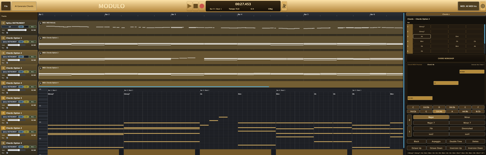

# MODULO AI DAW

MODULO (Musician-Owned DAW User-Led Orchestration) is a standalone DAW built on Tracktion Engine + JUCE, with an AI-native harmony workflow focused on chord generation and exploration.

This repository contains the code needed to build and run MODULO, including the custom DAW app and integrated ReaLchords-based generation flow.


## Why the Name "Modulo"

`Modulo` is not only an acronym. In computation, the modulo (`%`) operator returns the remainder after division. The remainder metaphor is central to this project:

- Most Music AI systems optimize toward a single "best" continuation.
- MODULO instead exposes the "remainder" of plausible harmonic futures.
- By generating multiple chord alternatives for the same melody, it helps the musician navigate the residual solution space that one-shot generation usually hides.

In short, MODULO is designed to return what deterministic generation leaves on the table.



## What MODULO Does

- Timeline-based DAW editing with audio + MIDI tracks.
- Real-time MIDI monitoring, recording, clip editing, and plugin hosting.
- Piano roll editing with lasso multi-select, smooth drag/resize, velocity coloring, and zoom.
- Chord option generation for melodies using a ReaLchords batch server.
- Chord inspection panel with playback-follow highlighting.
- Enhanced transport UI with bars/beats + time + tempo + key + time signature.
- Branded `Modulo.app` bundle with custom dock icon.

## Novelty and Thesis Focus

The novelty is not only "AI chord generation" in isolation. The contribution is an integrated musician-first interaction system where harmony generation, theory-aware editing, and timeline context all stay connected in one live DAW loop.

Core contribution axes:

- **Algorithmic harmony exploration, not one-shot prediction:** melody-conditioned generation returns multiple viable accompaniments, materialized as comparable tracks in-context.
- **Theory-operable editing surface:** users can transform generated material with operations musicians already reason in (quality, inversion, octave, semitone, block/arpeggio, double-time), directly at bar/beat cells.
- **DAW-native control loop:** options are not abstract model outputs; they are immediately playable/editable MIDI in arrangement context with instrument, timing, and transport feedback.
- **Musician agency preserved:** the system prioritizes rapid audition + comparison + revision over forcing a single "best" model answer.

This is the thesis direction: expanding harmonic decision space for advanced users who think in functional harmony, voicing movement, and arrangement context, while still keeping iteration speed high enough for practical songwriting and production.

### Why this matters for Music AI

- **From answer-machine to co-creator:** The model proposes alternatives; the artist performs selection, transformation, and arrangement judgment.
- **Supports real compositional cognition:** Harmonic writing is exploratory and comparative. MODULO encodes that branching process directly.
- **Higher controllability with less friction:** Edits happen on the same grid where music is heard, without context switching to external tools.
- **Research-to-production bridge:** The workflow is embedded in a real DAW runtime (recording, plugins, transport, timeline), not a disconnected notebook prototype.
- **Diversity without randomness theater:** Multiple candidates are surfaced and can be transformed deterministically via theory operations, reducing collapse to generic patterns.

## Music-Theory-First Interaction Design (HCI Novelty)

MODULO's HCI contribution is the **Chord Workshop**: a persistent, grid-aware harmony editing environment that keeps symbolic intent and sonic feedback tightly coupled.

- **Bar/beat cell model:** Each row is a bar, subdivided by beats, so harmony edits occur where musicians already reason temporally.
- **Persistent controls instead of hidden popups:** Theory operations remain visible and discoverable, reducing interaction overhead and mode confusion.
- **Live chord-state feedback:** The workshop tracks currently playing chord position and displays chord MIDI preview with pitch labels, so edits can be evaluated while transport is running.
- **Embodied theory operations:** Actions such as inversion, semitone shift, and quality changes manipulate the actual MIDI realizations and preserve timing semantics.
- **Comparative workflow support:** Multiple generated chord-option tracks can be inspected and reshaped quickly, enabling A/B-style harmonic decision making.

This is a deliberate HCI stance: advanced users should be able to operate in music-theory terms without sacrificing DAW immediacy.

## AI Technical Deep Dive

MODULO's harmony subsystem follows an online accompaniment framing rather than an offline "generate entire song and accept" paradigm.

- **Online conditioning pipeline:** Melody is converted into a time-stepped representation suitable for local model serving, preserving alignment to timeline context.
- **Multi-hypothesis generation:** The system requests several accompaniment candidates for the same melody and instantiates each directly as an editable MIDI track.
- **Timeline-faithful reconstruction:** Model-domain events are converted back into beat-accurate DAW MIDI clips with bar/beat coherence.
- **Theory-aware post-generation transformations:** Generated chords can be transformed with deterministic operations (quality/root/inversion/octave/semitone/block/arpeggio/double-time) while preserving cell semantics.
- **Gesture-level rendering controls:** Block/arpeggio behavior, beat-locked arpeggio timing, and sustain-shaping help close the gap between model output and production-ready material.
- **In-context evaluation loop:** Candidate ranking is performed by the musician during playback in arrangement context, not by model confidence alone.

The net effect is a hybrid intelligence loop: probabilistic generation for option discovery plus deterministic music-theory operations for controlled refinement.

## Architecture Overview

- `examples/Reason/`  
  Main MODULO app implementation (UI, timeline, transport, recording, piano roll, chord inspector).
- `examples/Reason/SessionController.*`  
  Core DAW/session logic: transport, recording, MIDI routing, plugin insertion, clip operations, chord-track creation.
- `examples/Reason/ReasonMainComponent.*`  
  Main orchestration and ReaLchords request/response integration.
- `tools/realchords/`  
  Local ReaLchords batch server environment and launch scripts.

## Build and Run (macOS)

### 1) Clone

```bash
git clone https://github.com/takakhoo/MODULO_AI_DAW.git
cd MODULO_AI_DAW
```

### 2) Configure + Build

```bash
cmake -S . -B build
cmake --build build --target Reason
```

Note: The internal CMake target name remains `Reason` for stability, but it builds `Modulo.app`.

### 3) Launch

```bash
open "build/examples/Reason/Reason_artefacts/Modulo.app"
```

## ReaLchords Setup (Chord Generation)

MODULO expects a local ReaLchords batch server. If not running, generation requests fail gracefully with startup hints.

Typical local launch:

```bash
tools/realchords/.venv/bin/python tools/realchords/realchords_batch_server.py
```

Optional environment overrides:

- `REALCHORDS_HOST` (default `127.0.0.1`)
- `REALCHORDS_PORT` (default `8090`)

See `examples/Reason/REALCHORDS_WALKTHROUGH.md` for deeper integration/training notes.

## Credits and Citations

### Tracktion Engine Credit

MODULO is built on top of Tracktion Engine and JUCE. Tracktion Engine provides the core sequencing/editing/playback/plugin-host infrastructure that MODULO extends with custom UI and AI-assisted harmony workflows.

- Tracktion Engine repository: <https://github.com/Tracktion/tracktion_engine>
- Feature overview: `FEATURES.md` in this repository
- Tracktion Engine docs: <https://tracktion.github.io/tracktion_engine/modules.html>
- Tracktion benchmarks: <https://tracktion.github.io/tracktion_engine/benchmarks.html>
- Tracktion Developers page (licensing): <https://www.tracktion.com/develop/tracktion-engine>
- Tracktion Engine JUCE forum category: <https://forum.juce.com/c/tracktion-engine>

### ReaLchords Credit

MODULO's adaptive chord accompaniment direction is informed by ReaLchords:

**Adaptive Accompaniment with ReaLchords**  
Yusong Wu, Tim Cooijmans, Kyle Kastner, Adam Roberts, Ian Simon, Alexander Scarlatos, Chris Donahue, Cassie Tarakajian, Shayegan Omidshafiei, Aaron Courville, Pablo Samuel Castro, Natasha Jaques, Cheng-Zhi Anna Huang.  
Accepted at ICML 2024.  
arXiv: <https://arxiv.org/abs/2506.14723>  
DOI: <https://doi.org/10.48550/arXiv.2506.14723>

Key technical ideas in ReaLchords that motivate this project:

- online accompaniment generation for live/co-creative settings
- RL fine-tuning for adaptive temporal + harmonic coherence
- teacher-guided divergence/distillation to retain strong future-aware priors while operating online

## Licensing and Compliance Notes

When cloning/building/distributing MODULO, ensure licensing obligations are satisfied:

- Tracktion Engine uses GPL/commercial licensing; review Tracktion terms before distribution.
- JUCE licensing is separate; Tracktion Engine is not covered by a JUCE license, and vice versa.
- Some Tracktion features and terms vary by license tier/version (including enterprise scenarios).
- ReaLchords/RealJam and related model assets may carry separate upstream terms.
- Third-party libraries included in Tracktion Engine have their own licenses (see upstream Tracktion license documentation and notices).

In short: MODULO is a derivative application built on major upstream ecosystems, and proper attribution plus license compliance is required for real-world release.

## What You Need to Clone for MODULO

This repo is centered on the MODULO app path:

- Primary runtime app: `examples/Reason` (branded as Modulo at build/runtime).
- Core engine dependencies are kept in-repo because they are required to compile and run MODULO.
- Other Tracktion example targets are present, but MODULO development is concentrated in the files above.

## Repository

Target GitHub repository: [takakhoo/MODULO_AI_DAW](https://github.com/takakhoo/MODULO_AI_DAW)

